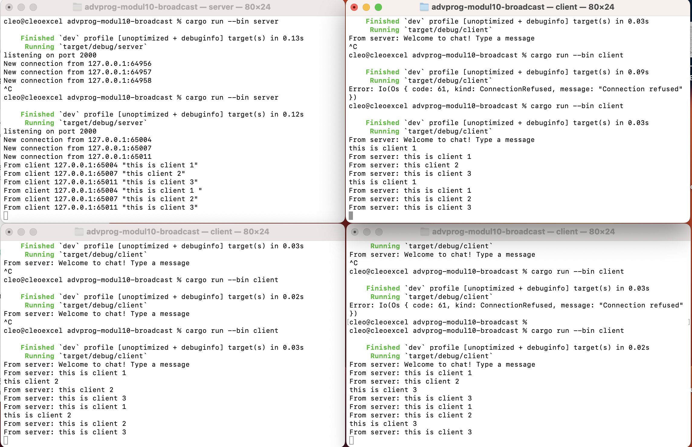

### 2.1 Run a server and three clients

Pada gambar di atas, terlihat bahwa saat seorang client mengirimkan pesan, server langsung menerima pesan tersebut dan menyebarkannya ke semua client yang sedang terhubung—termasuk pengirimnya sendiri. Ini  karena server menyimpan daftar seluruh koneksi client yang sedang aktif dan terus memantau adanya pesan masuk dari salah satunya. Ketika sebuah pesan diterima, server secara otomatis mengirimkan pesan tersebut ke seluruh koneksi dalam daftar.