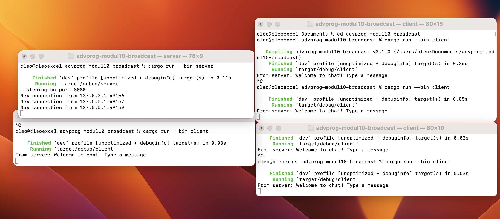

### 2.1 Run a server and three clients

Pada gambar di atas, terlihat bahwa saat seorang client mengirimkan pesan, server langsung menerima pesan tersebut dan menyebarkannya ke semua client yang sedang terhubung—termasuk pengirimnya sendiri. Ini  karena server menyimpan daftar seluruh koneksi client yang sedang aktif dan terus memantau adanya pesan masuk dari salah satunya. Ketika sebuah pesan diterima, server secara otomatis mengirimkan pesan tersebut ke seluruh koneksi dalam daftar.

### 2.2 Modifying Port

agar dapat berjalan dengan baik, kita perlu untuk mengubah kedua port pada client dan server menjadi 8080, hal ini dikarenakan apabila keduanya baik memiliki port yang tidak sama maka client tidak akan dapat terhubung ke server.

### 2.3: Small changes, add IP and Port

Pada gambar di atas, terlihat bahwa setiap pesan yang dibroadcast oleh server kini mencantumkan informasi mengenai asal pesan, yaitu client pengirimnya. Hal ini terjadi karena saya memodifikasi baris bcast_tx.send(text.into())?; di file server.rs menjadi bcast_tx.send(format!("{addr:?}: {text:?}"))?;. Dengan perubahan ini, setiap kali ada client yang mengirim pesan, server akan meneruskannya ke semua client lain dengan menyertakan alamat IP dan port pengirim. Format baru ini memungkinkan setiap client yang menerima pesan untuk langsung mengetahui siapa pengirimnya, karena identitas pengirim ditampilkan secara jelas dalam pesan.